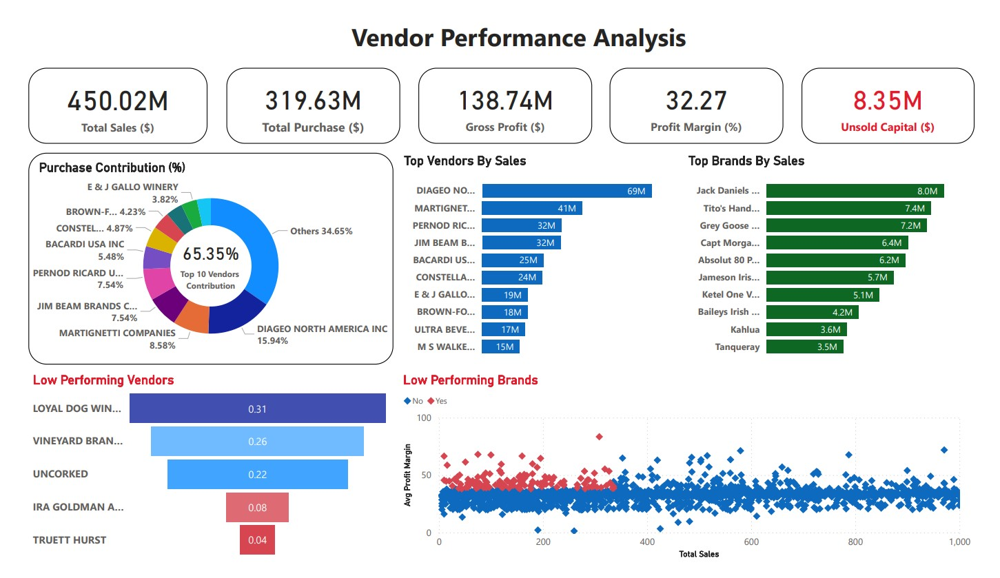

# 📊 Vendor Performance & Strategic Analytics

An end-to-end data analytics project that transforms **1.8GB+ of raw transactional data** into actionable business insights using **Python, SQL, and Power BI**.

## Project Overview

This project builds a **production-grade analytics pipeline** to analyze vendor performance, procurement efficiency, and profitability.

* Processed **12.8M sales records** and **2.3M purchase records**
* Designed a multi-stage **ETL pipeline (Python + SQL)**
* Created a **Power BI dashboard** for strategic decision-making
* Applied **statistical analysis & hypothesis testing** for business insights

## Tech Stack

* **Python** (Pandas, NumPy, logging, Statistical Analysis)
* **SQL (T-SQL)** – Data transformation & aggregation
* **Power BI** – Data visualization & dashboarding
* **SQLAlchemy** – Data pipeline integration

## Key Insights

* **73% Cost Reduction** achieved by shifting to bulk procurement
* **Higher Margins in Low-Volume Vendors** (~33% vs 31.8%)
* **Vendor Concentration Risk** → Top 10 vendors contribute **65%+**
* Identified **low inventory turnover vendors** causing capital blockage

## Dashboard Highlights

* Total Sales: **$450M+**
* Profit Margin: **~32%**
* Unsold Capital: **$8.35M**
* Pareto Analysis (Top 10 Vendors Contribution)

## Business Impact

* Identified **“Hidden Gem” vendors** with high margins
* Recommended **order consolidation strategy**
* Balanced **high-volume vs high-margin vendor strategy**
* Improved **inventory and procurement efficiency**

## Key Features

* Automated **data ingestion pipeline**
* Large-scale **SQL aggregation (multi-million rows)**
* **Statistical validation (T-Test, Confidence Intervals)**
* Interactive **Power BI dashboard**

## 📄 Project Report

For detailed analysis, methodology, and insights:

👉 *Refer to the full Project Report* : https://github.com/ShehrazSarwar/Vendor-Performance-Analysis/blob/main/Comprehensive%20Project%20Report.pdf 

## Conclusion

This project demonstrates how **data-driven decision-making** can optimize procurement, reduce costs, and improve profitability by balancing **volume-driven and margin-driven strategies**.

---

*This repository demonstrates a fusion of Data Engineering scale with the analytical depth of a Data Scientist.*
